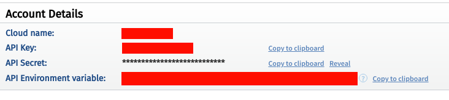
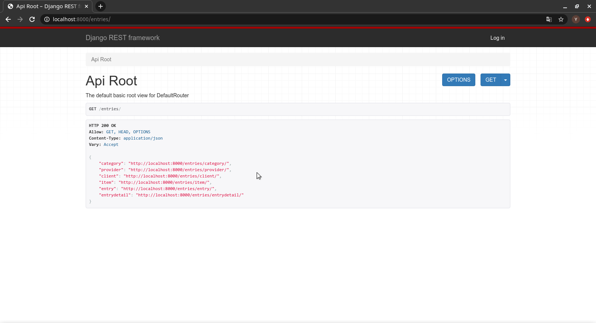
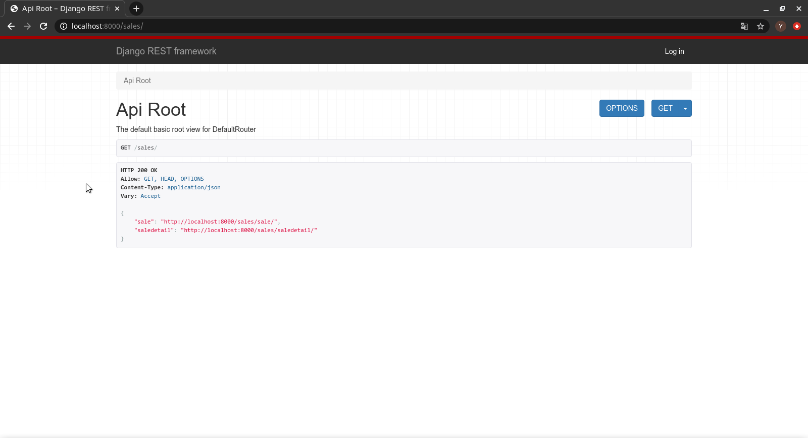

# Api market con django-rest-framework

 Api para la gestión de entradas y salidas de un mercado, tienda, etc


### Pre-requisitos 📋

```
 - Python 3 o superior

 - Instalar pip y virtualenv

 - Django 2 o superior

 - Tener una cuenta en cloudinary, puedes creartela en: 
  [Cloudinary/register](https://cloudinary.com/users/register/free) 


 


```

### Instalación 🔧

 _Dirigite a la ruta del directorio_

 Crea un entorno virtual:
```
 virtualenv nombre_de_tu_entorno -p python3
 
```
 Esto creara una nueva carpeta dentro del directorio, allí se instalaran todos los paquetes que necesitarás.

 Activa el entorno:
```
 source/nombre_de_tu_entorno/bin/activate
 
```

 Ve a tu cuenta de cloudinary y obtén el cloud_name, api_key y la api_secret

 

  _Dirigite a la raiz de tu directorio_

 Crea un nuevo archivo .env

 crea las variables CLOUD_NAME, API_KEY Y API_SECRET, e igualas con los datos proporcionados por tu cuenta en cloudinary
  
 algo así:

 ```
 CLOUD_NAME = 'ejemplo'
 API_KEY = 'ejemplo'
 API_SECRET = 'ejemplo'
 
```
 

 _Dirigite a la ruta del directorio donde se encuentre el archivo manage.py_

 Corre las migraciones:

```
 ./manage.py makemigrations

 ./manage.py migrate
 
```
Crea un súper usuario:

```
 ./manage.py createsuperuser
 
```
 Deberás asignar un nombre de usuario y una contraseña, ejemplo:

    Username: ola
    Email address: ola@example.com
    Password:
    Password (again):
    Superuser created successfully.

 Inicia el servidor:

```
 ./manage.py runserver
 
```

## Prueba la API ⚙️

_Puedes usar postman o alguna aplicación similar, aunque djangorestframework proveé una interfaz para que pruebes tu api_

 Dirigite a la ruta localhost:8000/entries/ para interactuar con la entrada de articulos o localhost:8000/sales/  
 para interactura con la salida de artículos

_Algo así se vería:_






## Construido con 🛠️

* [Django](https://www.djangoproject.com/) - El framework web usado.
* [Django rest framework](https://www.django-rest-framework.org/) - Herramienta para crear API web.


